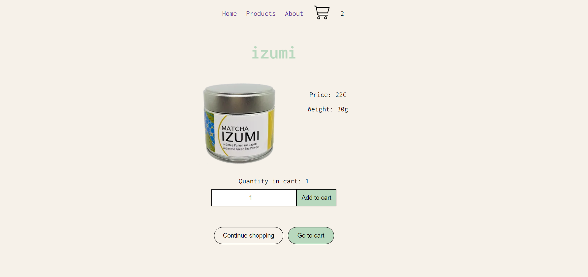
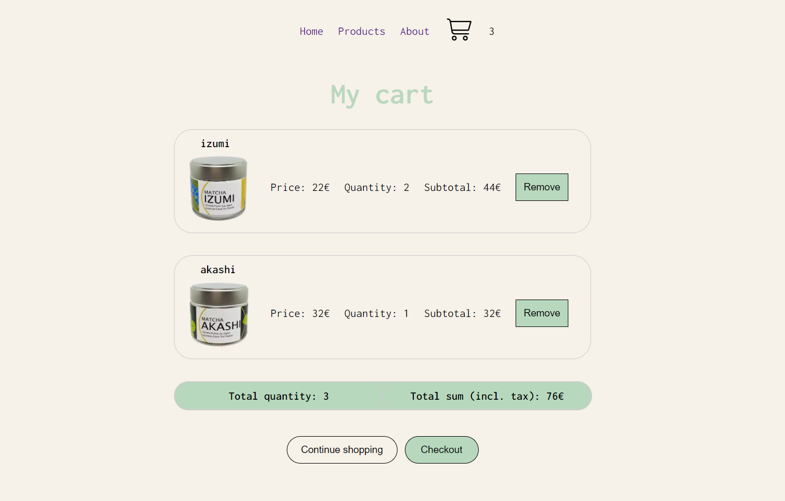
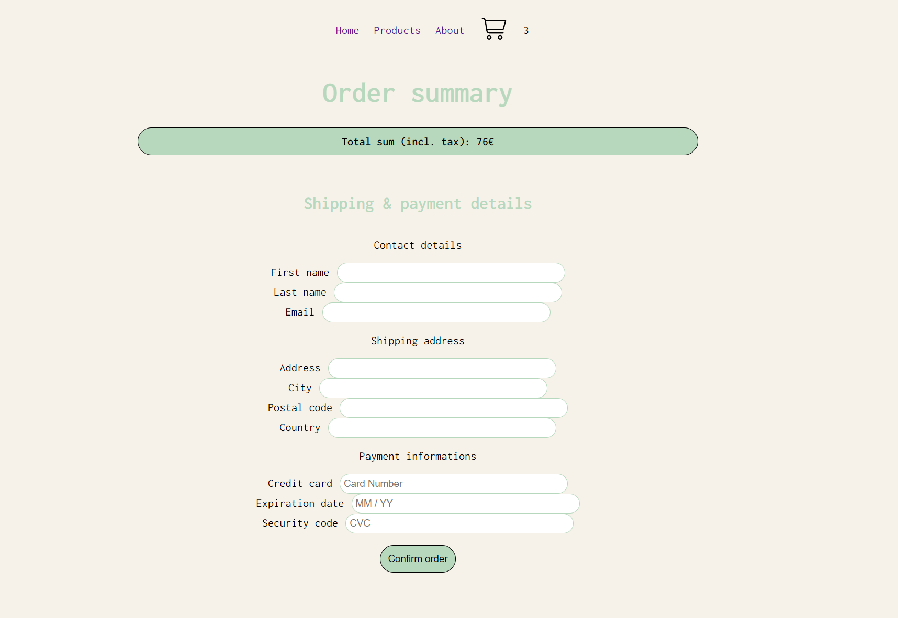

# E-commerce store: Matcha

## Description

Welcome to the matcha online store! This repository serves the purpose of showcasing a fully functional e-commerce store based on the knowledge and skills acquired and applied during the web development bootcamp.

The sources of images and content are from the following websites:

- https://matchamafia.com/
- https://www.chanomavienna.at/

Subsequently in order to extend and upgrade the matcha e-commerce-store experience the following features can be added:

- Add another product group, providing an essential kit for matcha preparation for home including a ceramic bowl, whisk, whisk stand, bamboo tea ladle and a strainer.
- Add a filter on the product page in order to be able to sort by product groups (namely: matcha powder, matcha sets)
- Provide validation of the input fields and customized alert information.
- Design dynamic pages.
- Sign up for a newsletter to be informed about matcha related events in Vienna, shop discounts, matcha recipes

Please take your time and browse through the web application. If you have any feedback or suggestions, please feel free to reach out to me.

Enjoy!

## Technologies used

- Next.js a JavaScript framework for building web applications, specifically for React-based applications. It is designed to make the process of building server-rendered React applications as easy and efficient as possible. Next.js is often used in conjunction with React to simplify server-side rendering, routing, and other aspects of web development.
- React is a JavaScript library for building user interfaces. React serves the purpose of creating dynamic, interactive web applications.
- Node.js is a server-side runtime environment that allows to build and run server-side applications using JavaScript.
- TypeScript is a superset of JavaScript that adds static typing and other features to the JavaScript language.
- SQL is a standardized programming language used for managing and manipulating relational databases. It is designed for querying, updating, and managing data in a relational database management system (RDBMS). SQL is crucial for interacting with databases, and it is a fundamental tool for data management.
- Playwright is an open-source automation framework for web browsers that allows developers and testers to automate interactions with web pages and web applications.
- Jest is an open-source JavaScript testing framework. It is primarily used for testing JavaScript code, including code written in React, Vue, Angular, and other JavaScript frameworks.

## Screenshots

This is to give you a glimpse of the application:







## Set up instructions

Clone the project on your local machine (run each line individually):

```
git clone <url>
cd <repo name>
pnpm
```

Connect to default database as admin:

```
On Windows
psql -U postgres
```

on macOS

```
psql postgres
```

Set up the database:

```
CREATE DATABASE <database name>;
CREATE USER <user name> WITH ENCRYPTED PASSWORD '<user password>';
GRANT ALL PRIVILEGES ON DATABASE <database name> TO <user name>;
\connect <database name>;
CREATE SCHEMA <user name> AUTHORIZATION <user name>;
```

Once you have succesfully run these queries, quit psql with

```
\q
```

Connect to PostgreSQL database via psql - on Windows and macOS

```
psql -U <user name> <database name>
```

In the repository's directory, run migrations using ley:

```
pnpm migrate up
```

Create a .env file:
Open the project in your code editor

Copy the content of the .env.example file into the .env file
Replace xxxxxxxx with the access information
add .env file to .gitignore

Start deployment server:

```
pnpm dev
```

## Deployment instructions

Sign up on Fly.io
On the Fly.io Tokens page, generate a new Fly.io access token named GitHub Actions Deploy Token and copy it from the text box that appears - it will only be shown once

In GitHub repo under Settings → Secrets → Actions, click the New repository secret button at the top right of the page and create a new token with the name FLY_API_TOKEN and the token copied as the secret
On the command line, open the Fly.io login page in my browser using the following command:

```
flyctl auth login
```

Enter credentials in the browser window that appears and then click on the link Try Fly.io for free. Switch back to the terminal - it should now show a message like successfully logged in as <your email>.

Create an app, specifying the name using only lowercase letters and dashes:

```
flyctl apps create --name <app name> --machines
```

Create the Fly.io config files as demonstrated in the lecture (also available in the Next.js example repo)

Change your ley.config.mjs as in the lecture: add ssl config for Vercel

Change your util/config.mjs as in the lecture: exit early in production, alias Vercel database environment variables

Change your next.config.js as in the lecture: disable linting and type checking on build, since this happens earlier in the GitHub Actions deploy workflow

Add database credentials using Fly.io secrets, randomly generating the database name, username and password

```

flyctl secrets set PGHOST=localhost PGDATABASE=upleveled$(openssl rand -hex 16) PGUSERNAME=upleveled$(openssl rand -hex 16) PGPASSWORD=$(openssl rand -base64 32)

```

If your app needs any additional environment variables such as API keys, also add them to the secrets using the following pattern

```

flyctl secrets set <secret name>=<secret value>

```

NEXT*PUBLIC*. Instead of using environment variables for this, we recommend declaring a JavaScript variable in your code because this information is not secret - it will be exposed to the browser. If you absolutely need to set a NEXT*PUBLIC* environment variable, you can add it to your .env.production file.

Create a 1GB volume for the PostgreSQL database in the Bucharest region (slower region IDs: Amsterdam ams or Warsaw waw)

```

flyctl volumes create postgres --size 1 --region otp

```

Deploy the first version of the app:

```

flyctl deploy

```

You may receive a failed to fetch an image or build from source error during deployment:

Error failed to fetch an image or build from source: error building: executor failed running [/bin/sh -c yarn build]: exit code: 1

Deploys may fail for a number of reasons, to find the real error message you will need to scroll up in the logs and find the first line that looks like an error.
